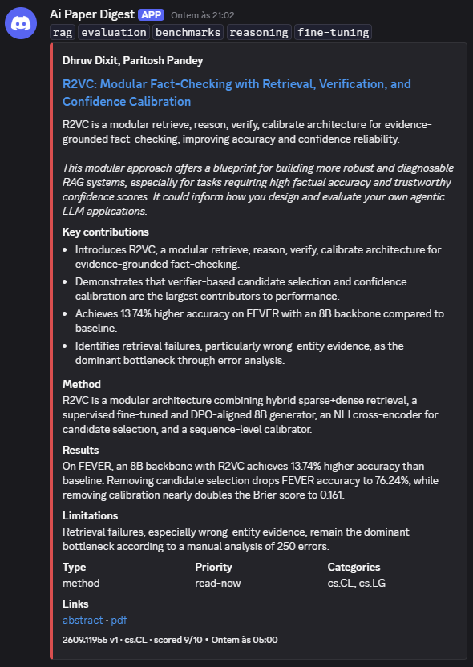
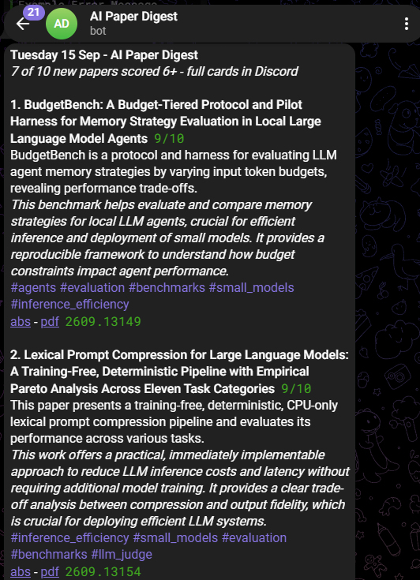

# AI Paper Digest

An n8n pipeline that reads the daily arXiv output, scores every new paper against a written description of what I actually work on, posts the survivors as rich cards in Discord, and sends a ranked digest to Telegram before I open my laptop.

Two n8n workflows and a small Python service that remembers what they did. No custom nodes, no paid services — it runs on free API tiers.

---

## The pipeline


<details>
<summary>Same thing as text</summary>

```
                    ┌──────────────┐
  cron 17:30  ─────▶│    Config    │   categories · thresholds · reader profile
   (Mon–Fri)        └──────┬───────┘
                           ▼
   arXiv RSS feed ──▶ parse XML ──▶ normalise ──▶ drop revisions  (~64 papers)
                                                        │
                                       ┌────────────────┘
                                       ▼
                     POST /rank  ──▶ apply ranking ──▶ cap 10 ──▶ dedupe on ID
                  (local service, free,                                │
                   no per-call ceiling)                                │
                          ┌────────────────────────────────────────────┘
                          ▼
                  ┌───────────────┐   one paper per iteration
                  │ Loop Over     ├──▶ throttle 8s ──▶ Gemini + JSON schema
                  │ Papers        │                          │
                  └───────┬───────┘                    score ≥ 6 ?
                          │ done                        │         │
                          │                            yes        no
                          │                             ▼         ▼
                          │                     Discord card    skip
                          │                             │
                          │                             ▼
                          │                   POST /store ──▶ SQLite
                          │◀─────────────────────────────────┘
                          ▼
             select · top 8 · render HTML ─────────▶  Telegram
```

</details>

<details>
<summary>Regenerating the diagram</summary>

The image is rendered from [`docs/images/pipeline.html`](docs/images/pipeline.html), which uses the
dashboard's own palette so the two stay in the same visual language. Edit the HTML, then:

```bash
chrome --headless=new --disable-gpu --hide-scrollbars \
       --force-device-scale-factor=2 --window-size=1680,988 \
       --default-background-color=0b0f16ff \
       --screenshot=docs/images/pipeline.png \
       docs/images/pipeline.html
```

Keeping the source next to the output is the point: a diagram nobody can regenerate goes stale
the first time the workflow changes, which is exactly what happened to the one before it.

</details>

A typical weekday: ~115 announcements, ~64 survive once revisions are dropped, the top `max_papers_per_run` by relevance go to the model, and whichever clear the threshold reach Discord and the phone. The cap ships at 10 — a free-tier budget expressed in papers rather than in tokens.

---

## Outputs

### Discord — the archive



One embed per paper in `#ai-papers`, colour-coded by score. Permanent and searchable: the channel *is* the archive.

### Telegram — the nudge



One ranked message a day, capped at eight papers, short enough to read standing up. It arrives even when nothing clears the threshold — it says `0 of N` — because silence should mean something is broken, never that the day was quiet.


---

## Design notes

The parts that were not obvious when I built it.

**The source is arXiv's RSS feed, not its query API.** Two reasons, and the second is the one that bites. It is the better *fit*: the feed is literally the day's announcement list, so there is no date window to tune, no paging, and every item carries an `announce_type`. And the query API rate-limits **per IP** — on n8n Cloud the outbound address is shared with every other tenant, so a `429` can arrive because of traffic that is not yours and no amount of backing off on your side will fix it. The RSS host is a separate service with separate limits.

**Revisions are dropped before anything is spent on them.** Roughly 45% of a daily feed is `replace` or `replace-cross` — new versions of papers announced weeks ago. The filter is `notStartsWith "replace"` rather than `notEquals "replace"`, because `replace-cross` exists and an equality test lets it through silently. That detail cost 16 papers a day of wasted ranking before a test caught it.

**Deduplication is cross-execution, not per-run.** arXiv keeps re-listing cross-posted papers for several days, so a naive daily job re-summarises the same work repeatedly and pays for it every time. The `Remove Duplicates` node runs in *Remove Items Seen in Previous Executions* mode keyed on the arXiv ID, with a 10,000-entry history. That single node is the difference between a demo and something you can leave running.

**The relevance filter is a written profile, not a keyword list.** Keywords catch `"retrieval"` in a paper about retrieval-augmented image compression and miss a genuinely relevant paper that never uses the word. The `Config` node holds a plain-English description of what I work on and what I don't care about, and the model scores against it. Changing what lands in my inbox means editing a paragraph.

**The scoring rubric is anchored.** "Rate this 0–10" drifts upward on every run until everything is an 8. The system prompt defines what a 3, a 5, a 7 and a 9 mean, and explicitly says a normal day should produce a handful of 7+, not twenty.

**Two-stage ranking, because the budget is a handful of model calls.** `max_papers_per_run` ships at 10. Without a cheap way to order candidates, those ten go to the ten *newest* papers — sampling, not selecting. So every candidate is embedded and scored against the reader profile by cosine similarity; only the shortlist reaches the chat model. That is retrieve-then-rerank, with embeddings as the cheap stage.

**The cheap stage runs locally, and that is not a preference.** It started as one `batchEmbedContents` call on the same Gemini key — until the store showed a run reporting `papers=60 skipped=862`. The endpoint caps a request at 100 texts, concepts are sent first because nothing can be scored without them, and everything past the ceiling kept its chronological place instead. The pre-filter was silently not running on 93% of the feed. It now calls [`ranker/`](ranker/), a small FastAPI service with no per-call ceiling, which is also where the store and the evaluation harness live.

**Embeddings cannot represent negation, so the profile is split.** *"Not interested in reinforcement learning for games"* embeds close to *"interested in reinforcement learning for games"* — the content words dominate and `not` is a rounding error. Fold the whole profile into one vector and it faithfully attracts everything the reader asked to avoid. The ranker splits wants from don't-wants and subtracts, per fragment rather than per line, because one sentence often holds both.

**The ranker degrades, it does not break — and it says so.** `Rank via Service` continues on error, and `Apply Ranking` falls back to chronological order, including when the response comes back the wrong length, since misaligned vectors would make every score silently wrong. A digest of the newest is worse than a digest of the best and far better than a failed run. But the fallback also puts `⚠ ranked by recency` in the Telegram header, because the earlier version degraded *quietly* — which is how a pre-filter skipping 93% of the feed went unnoticed. The silence was the bug, not the fallback.

**Shapes are validated by the schema, values by code.** A structured output parser sits on the LLM chain, so `relevance_score` arrives as a number and `topics` as an array. But the schema stops there on purpose: Gemini supports only a subset of JSON Schema and quietly ignores `enum`, `minItems` and `minimum` — while the parser still validates against them on the way back, failing responses the model was never told to constrain. That mismatch is what *"Model output doesn't fit required format"* actually means.

So ranges and enumerations live in the prompt and are enforced in `Merge Analysis`: the score is pulled out of whatever arrived (`"8/10"` included — `Number("8/10")` is `NaN`, which would quietly score a relevant paper 0 and drop it), enums snap to the allowed set, and blank fields become *"Not stated in the abstract."* rather than a hole in the card. Deterministic, and it survives swapping the provider.

**Batch size is 1, deliberately.** A failure on paper 34 costs one API call, not the whole run, and the loop picks up where it stopped. After three retries that paper is skipped through the chain's error output rather than taking the digest down with it.

**Thinking tokens are billed against `maxOutputTokens`.** Gemini 2.5 Flash reasons before it answers, so a budget sized for the ~700 tokens of visible JSON gets eaten by the reasoning and the response is truncated mid-string. It surfaces as a schema-parser error rather than a truncation warning, which sends you debugging the wrong thing. The budget is 8192.

**A free tier is a rate limit, not a smaller quota**, so it is defended twice. A `Limit` node caps how many papers reach the model at all — the budget, expressed in papers — and a `Wait` node spaces the calls eight seconds apart, holding the run at 7.5 requests a minute. Retries deliberately do the lesser share of the work: n8n caps retry spacing at five seconds, which is nowhere near enough to clear a per-minute quota, and a retry after a `429` has already spent another request against it. Spacing the calls up front is the part that works.

**The cap sits before the deduplicator, and that ordering is the whole point.** Everything the deduplicator sees is recorded as seen, for good. Cap afterwards and you mark forty papers read that were never analysed — they never come back, and nothing tells you. Cap before it and the surplus is simply not considered today.

**The threshold gate is an IF, not a Filter.** Both branches feed back into the loop. A Filter would silently drop rejected items and the loop would stall on an empty batch — a failure mode that only shows up on the day nothing is relevant, which is exactly the day you are not watching.

**Discord's embed limits are enforced in code, not hoped for.** Title 256, description 4096, field value 1024, and 6000 characters across the *whole* embed counted together. Exceed any one of them and the API returns a `400` with no usable error body. `Build Paper Embed` truncates each field and then halves the longest one until the total fits — dropping fields instead would silently lose a whole section. See [docs/discord.md](docs/discord.md#limits).

**Webhook, not bot — and an HTTP Request node, not the Discord node.** The workflow only ever posts. A bot would cost an application, a token, an invite and a permissions model; a webhook is one URL. And since the payload has to be assembled in code regardless — the Discord node's embed UI is a fixed collection that cannot express a variable number of fields — posting it directly removes a layer whose parameter names shift between node versions, for no loss of function.

**`allowed_mentions: { parse: [] }` on every post.** arXiv titles are not a trusted input. One containing `@everyone` would otherwise ping the whole server.

**Tags are slugged in code, not in the prompt.** The model returns `RAG`, `rag ` and `Rag` across three runs. Normalisation happens in `Merge Analysis` where it is deterministic, so the tag line stays greppable.

**Telegram output is chunked on paper boundaries.** The Bot API hard-fails at 4096 characters and its HTML parse mode returns a `400` on a single unescaped `<` in a paper title. Both are handled in `Build Telegram Digest`.

**The pipeline remembers, and that is what makes it checkable.** Every paper a run touches — posted *and* rejected — goes to a small FastAPI service backed by SQLite, along with the embedding that ranked it. The rejects are the point: the store exists to answer *was the cheap ranker right?*, and that question needs both halves of the decision.

Three things become answerable once the data is there, and none of them are answerable without it:

| | |
| --- | --- |
| `GET /metrics` | Spearman and recall@k between the cosine score and the LLM score. Is the pre-filter carrying signal, or is it an expensive shuffle? |
| `GET /similar/:id` | Nearest neighbours by meaning — the same group reposting under a new number, or two teams landing the same idea in one week. The arXiv ID cannot catch either. |
| `GET /clusters` | UMAP → HDBSCAN → c-TF-IDF over the stored embeddings. The workflow's tags answer *which of my interests is this?*; this answers *what is the field doing?*, and is allowed to disagree. |

**SQLite, not Postgres.** Ten papers a day is a few thousand a year, and a brute-force cosine over a few thousand 768-dimension vectors is milliseconds in numpy. pgvector would be a server to maintain in exchange for nothing at this scale. Every statement lives in one module, so changing that later is one file rather than a project.

**Reduce before clustering.** HDBSCAN degrades in high dimensions: as dimensionality grows the distances between all pairs converge and a density-based method has no density left to find. Projecting 768 dimensions to about 5 with UMAP restores the contrast. Skipping that step is the usual reason someone reports "HDBSCAN found one giant cluster and a lot of noise".

**Reactions close the loop.** A tap on a Discord card is the cheapest feedback that exists — the reader is already looking at it. Making that work needed one non-obvious thing: a webhook returns an empty `204` unless the URL carries `?wait=true`, and without the message id that comes back there is no way to find the card again. There is no endpoint that lists a webhook's own messages.

Reading those reactions needs a **bot** token rather than the webhook, because on Discord writing and reading are separate permissions. The workflow stays webhook-only; one endpoint on the service needs more.

**Failures are loud.** A second workflow is registered as the Error Workflow and sends the failing node, the message and a deep link to the execution. A scheduled workflow that quietly stopped working three weeks ago is worse than no workflow at all.

---

## Repository

```
workflows/
  ai-paper-digest.json     the pipeline — import this
  error-handler.json       failure alerts — import this too
ranker/                    the memory, and an optional local ranker
  store.py                 SQLite: papers, analyses, embeddings, feedback
  clustering.py            UMAP → HDBSCAN → c-TF-IDF topic discovery
  discord.py               reading reactions back off the cards
  ranker.py                profile splitting, negation handling, scoring
  eval.py                  does the cheap ranker agree with the expensive one?
  app.py                   FastAPI, the whole HTTP surface
  tests/                   91 tests, no model and no network
docker-compose.yml         n8n and the service side by side
docs/
  setup.md                 credentials, webhook, first run
  architecture.md          node-by-node walkthrough and data shapes
  discord.md               embed anatomy, limits, webhook vs bot
.env.example               the two values the workflow reads from the environment
```

## Requirements

- n8n **1.62 or newer** — earlier versions do not have the cross-execution mode of `Remove Duplicates`, which the deduplication depends on. Self-hosted or Cloud both work; [docs/setup.md](docs/setup.md#where-to-run-n8n) covers the trade-off, which comes down to whether the machine is awake when the schedule fires
- A Google AI Studio API key — the free tier is enough (or any other chat model node; see [docs/setup.md](docs/setup.md#swapping-the-model))
- A Discord webhook URL, and optionally a bot token if you want reactions read back
- A Telegram bot token and your chat ID
- Docker, if you want the store — `docker compose up` brings up n8n and the service together

Nothing else. The ranking stage reuses the same Gemini key, and arXiv's RSS feed needs no credentials — the workflow just identifies itself with a `User-Agent`, as arXiv asks.

## Getting started

```bash
git clone <this repo>
cp .env.example .env     # fill in the webhook and chat id
docker compose up -d --build
```

Then import both workflow files under **Workflows → Import from File** and follow [docs/setup.md](docs/setup.md). About ten minutes, most of it spent creating credentials.

The service is optional. Leave `STORE_URL` empty and the pipeline runs exactly as it did before it existed — it loses the memory, never the digest.

## Running cost

**Nothing.** It runs on Google AI Studio's free tier.

Per weekday `max_papers_per_run` papers reach the model — ten by default — each call sending the abstract plus the profile at about 1.6k input tokens and returning about 600. That is roughly **16k in / 6k out** for a whole day, which is nowhere near any free-tier ceiling. The binding constraint is requests per minute, not tokens per day, which is what the throttle is for.

Two caveats worth knowing rather than discovering. Google publishes current free-tier limits per model and changes them, so check them against whichever model you attach. And free-tier traffic falls under different data-use terms than paid — irrelevant here, since everything sent is a public arXiv abstract, but it would matter if you pointed the same pipeline at anything private.

If volume ever becomes the problem, raise `relevance_threshold` or narrow `arxiv_categories`; both are one-field edits in `Config`. On a paid key, set `llm_throttle_seconds` to `0` and the same run costs cents a day on a flash-class model.

## Known limits

- **Abstracts only.** The model never sees the full text, and the prompt forbids it from inventing what it cannot see. `Results` will often read *"Not stated in the abstract."* — that is the design working, not a bug.
- **`published` is the announcement date, not the submission date.** RSS stamps every item in a feed with the same timestamp, so papers cannot be ordered by recency within a day. Nothing downstream needs that ordering — the ranker sorts by relevance — but it is why there is no date-window filter any more.
- **Discord is still a log, not a database.** You cannot sort a channel by relevance or filter to unread. That was the argument for adding a store rather than fighting Discord — the structured record now lives in SQLite, but nothing renders it; the queries are HTTP endpoints, not a UI.
- **The feedback loop exists but is unproven.** Reactions are collected and joined to the scores; whether the LLM's judgement actually predicts what I open is a question the data has not answered yet. `GET /metrics` refuses to report on fewer than twenty scored papers rather than showing a correlation computed over five, which would be worse than showing nothing.
- **Clustering needs volume.** A few hundred papers before the topics mean anything. Below that HDBSCAN correctly reports that it found nothing, which is the right answer and an unsatisfying one.
- **Abstracts only, still.** The store makes a deeper second pass on the top-scoring paper straightforward — fetch the HTML, re-analyse — but that is not built.

## License

MIT
